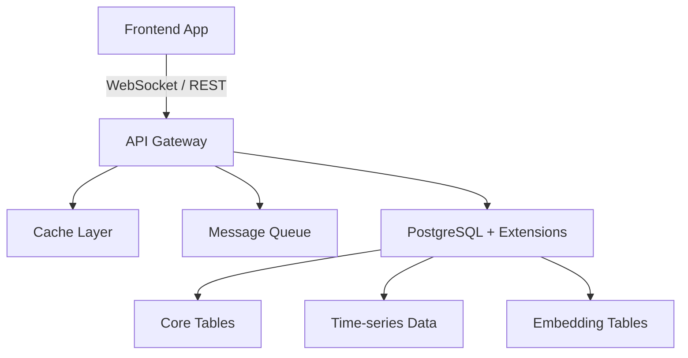

# Markdown

## Overview

Use this skill when creating, editing, or reviewing markdown files. It ensures all markdown output follows the project's formatting conventions and lint rules. Formatting is handled by markdownlint-cli2 and prettier, but non-auto-fixable rules must be respected during generation.

## Core Principles

- **Auto-formatting**: markdownlint-cli2 and prettier auto-format markdown files on save. Run `pnpm format` to apply prettier formatting. Try to match the expected format when generating markdown, but minor formatting issues will be auto-fixed.
- **Non-auto-fixable rules are mandatory**: The rules listed below and lint rules that are not auto-fixable must be respected, because they will not be corrected automatically.
- Follow the markdown style shown in the Example section as the reference for well-formatted documents.

## Skill-Specific Guidelines

### Blank line after headings (MD022)

Every heading must be followed by a blank line before any content. This is not auto-fixable and will cause lint errors if missing.

```md
<!-- Bad: no blank line after heading -->

## Configuration

Configure the settings.

<!-- Good -->

## Configuration

Configure the settings.
```

### Format tables with aligned columns

Tables must be formatted with consistent column widths. Pad each cell so that the pipe characters (`|`) align vertically and the separator row uses dashes matching the column width. This makes tables readable in source form.

```md
<!-- Bad: unaligned, minimal separators -->

| Component | Technology    | Notes              |
| --------- | ------------- | ------------------ |
| Backend   | NestJS        | Same as production |
| Database  | PostgreSQL 16 | Docker             |
| ORM       | Prisma        | Type-safe queries  |

<!-- Good: aligned columns with consistent width -->

| Component | Technology    | Notes              |
| --------- | ------------- | ------------------ |
| Backend   | NestJS        | Same as production |
| Database  | PostgreSQL 16 | Docker             |
| ORM       | Prisma        | Type-safe queries  |
```

### Don't use number and parenthesis in header

Headers must not combine a number with a parenthesis. Numbers without parenthesis are accepted.

```md
<!-- Bad -->

### 1) Section Name

<!-- Good -->

### Section Name

### 1. Section Name
```

### Limit emoji usage

Emojis are accepted but must serve a functional purpose. Don't use emojis just for decoration.

**Valid uses:**

- Check and cross marks for pros/cons or allowed/disallowed in tables or short lists
- Warning symbols for important warnings or notices
- Color circles or squares to indicate criticality levels (green/yellow/orange/red)
- Other emojis are accepted when they serve a clear functional purpose - the above list is not exhaustive

**Invalid uses:**

- Number emojis instead of plain numbers - just use `1.`, `2.`, `3.`
- Emojis in headers (e.g., `# Structure`, `## Principles`) - headers must be plain text unless there is an exceptional reason
- Decorative emojis on every section to make it "look nice"
- Repeated check marks on every item in a list - just use a regular list

```md
<!-- Bad -->

# Mono-Repo Structure

### 1. Apps Are Deployable Units

### 1 root package.json

### 1 package.json per app

<!-- Good -->

# Mono-Repo Structure

### 1. Apps Are Deployable Units

- 1 root package.json
- 1 package.json per app
```

### Don't use ASCII diagrams

Documentation should be easily consumable by LLMs. ASCII box diagrams with special box-drawing characters are hard to parse and maintain.

- For simple flows, use arrow notation on separate lines
- For real diagrams that need structure, use Mermaid code blocks

````md
<!-- Good: simple multi-line flow -->

Frontend Application
-> (WebSocket / REST)
-> API Gateway
-> Cache Layer
-> Message Queue
-> PostgreSQL + Extensions
-> Core Tables (Operational)
-> Time-series Data
-> Embedding Tables

<!-- Good: Mermaid for complex diagrams -->


````

### Don't overuse horizontal rules

Horizontal rules (`---`) must not be used to separate normal sections. Headings already provide visual and semantic separation.

Reserve `---` for cases where a deliberate break is meaningful, such as separating frontmatter, marking a distinct shift in context within a section, or separating appendix content.

```md
<!-- Bad: --- between every section -->

## Installation

Install the package.

---

## Configuration

Configure the settings.

---

## Usage

Run the command.

<!-- Good: headings are sufficient -->

## Installation

Install the package.

## Configuration

Configure the settings.

## Usage

Run the command.
```

### Indent content inside list items

Content that belongs to a list item (code blocks, paragraphs, nested lists) must be indented to align with the item text. Unindented content breaks the list and causes MD029 lint errors on the next item, because the numbering restarts.

````md
<!-- Bad: code block breaks the list, second item restarts at 1 -->

1. First item

```text
Code block
```

1. Second item

<!-- Good: code block is indented, list continues -->

1. First item

   ```text
   Code block
   ```

2. Second item
````

### Specify language on code blocks (MD040)

Fenced code blocks must have a language identifier. This enables syntax highlighting and helps tools parse the content correctly.

````md
<!-- Bad -->

```
sudo apt install curl
```

<!-- Good -->

```bash
sudo apt install curl
```
````

### Don't use emphasis as heading (MD036)

Bold text must not be used as a substitute for headings. Use proper heading syntax instead, which provides semantic structure and enables navigation.

```md
<!-- Bad: bold text acting as a heading -->

**Tier 1 (Must Have)**

- Coinbase
- Kraken

<!-- Good: proper heading -->

## Tier 1 (Must Have)

- Coinbase
- Kraken
```

### Document structure

Follow this general structure for markdown documents:

- Start with a top-level heading (`# Title`)
- Use hierarchical headings (`##`, `###`, `####`) for sections
- Separate sections with a single blank line
- Use fenced code blocks with a language identifier when applicable
- Use tables for structured comparisons
- Place references and links at the end of the document

## Instructions

1. **When reviewing or fixing a markdown file**: Run `pnpm format` first to auto-fix formatting issues (table alignment, spacing, trailing whitespace). Then check for non-auto-fixable rule violations and fix or flag them.
2. **When creating a markdown file**: Follow the document structure guidelines and all rules listed above. Use the example below as a style reference. Run `pnpm format` after writing the file.
3. **When editing a markdown file**: Read the file first, then apply changes while preserving the existing style and respecting all rules. Run `pnpm format` after editing.

## Output Guidance

When the skill is invoked directly, output a human-readable summary:

- Status (reviewed, created, or edited)
- File path
- List of non-auto-fixable issues found, if any

## Example

The following example shows the preferred markdown format style.

````md
# Project Setup Guide

## Description

### API Framework

The API framework handles routing, middleware, and request processing. It supports RESTful endpoints, WebSocket connections, and GraphQL queries out of the box.

### Database Layer

Reliable and scalable storage designed for high-throughput workloads. Provides connection pooling, automatic failover, and read replicas for horizontal scaling.

### Storage Types

#### Block Storage

- **Type**: Block storage
- **Access**: Presents virtual block devices to clients
- **Use Cases**: Ideal for virtual machine disks, databases, and applications requiring raw block devices

#### Summary Comparison

| Feature      | Block Storage                     | File Storage                      |
| ------------ | --------------------------------- | --------------------------------- |
| Storage Type | Block device                      | File system                       |
| Access Mode  | RWO; RWX with `Block` volume mode | RWX with `Filesystem` volume mode |

## Quick Start

### Installation

```bash
npm install my-package
npm run setup
```

### Cleanup

```bash
npm run teardown
rm -rf ./data
```

## References

- [Getting Started](https://example.com/docs/getting-started)
- [API Reference](https://example.com/docs/api-reference)
````
